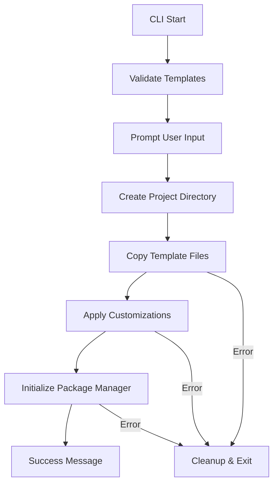

# Agentic Coding: Humans Design, Agents code!

> If you are an AI agent involved in building this CLI tool, read this guide **VERY, VERY** carefully! This is a **CLI tool for creating projects**, not a PocketFlow project itself. Focus on CLI development, template management, and project generation workflows.
{: .warning }

## Project Overview

This is `create-pocketflow`, a command-line tool that generates new PocketFlow projects from templates. Think of it as similar to `create-react-app` or `npm init` but specialized for PocketFlow projects.

**Key Concept**: We build the CLI tool that creates projects; users build their actual PocketFlow applications using the generated templates.

## Agentic Coding Steps for CLI Development

| Steps                  | Human      | AI        | Comment                                                                 |
|:-----------------------|:----------:|:---------:|:------------------------------------------------------------------------|
| 1. CLI Requirements | ★★★ High  | ★☆☆ Low   | Humans understand CLI tool requirements and user experience.       |
| 2. Template Management  | ★★☆ Medium | ★★★ High  | AI helps design robust template discovery and copying mechanisms.   |
| 3. Project Generation   | ★★☆ Medium | ★★★ High  | AI implements the core project creation logic and validation.      |
| 4. Package Manager Integration | ★☆☆ Low | ★★★ High | AI handles different package managers (npm, yarn, pnpm, bun).    |
| 5. Interactive CLI      | ★☆☆ Low   | ★★★ High  | AI builds user-friendly command-line interfaces and prompts.       |
| 6. Template Expansion   | ★★☆ Medium | ★★☆ Medium | Humans specify future templates, AI implements extensible architecture. |
| 7. CLI Testing         | ★☆☆ Low   | ★★★ High  | AI writes comprehensive tests for CLI functionality and edge cases. |
| 8. Documentation       | ★★☆ Medium | ★★☆ Medium | Humans review UX, AI helps maintain technical documentation.        |

## Core CLI Responsibilities

### 1. Template Management
- **Discovery**: Find available templates in `template/` directory
- **Validation**: Ensure templates have required structure and files
- **Copying**: Safely copy template contents to new project directories
- **Customization**: Apply user preferences during template generation

### 2. Project Generation Workflow


### 3. Package Manager Support
- **Detection**: Auto-detect available package managers
- **User Choice**: Allow users to select preferred package manager
- **Initialization**: Run appropriate init commands (`npm install`, `yarn install`, etc.)
- **Script Compatibility**: Ensure generated scripts work across package managers

## CLI Architecture Patterns

### Template Loader Pattern
```typescript
// Template discovery and loading
interface Template {
  name: string;
  path: string;
  metadata: TemplateMetadata;
  validate(): boolean;
  copy(targetDir: string, options: CopyOptions): Promise<void>;
}

class TemplateManager {
  discoverTemplates(templatesDir: string): Template[]
  validateTemplate(templatePath: string): boolean
  loadTemplate(name: string): Template
}
```

### Project Generator Pattern
```typescript
// Core project generation logic
class ProjectGenerator {
  constructor(
    private templateManager: TemplateManager,
    private packageManager: PackageManager
  ) {}

  async generateProject(options: GenerateOptions): Promise<void> {
    // 1. Validate template exists
    // 2. Create project directory
    // 3. Copy template files
    // 4. Apply customizations
    // 5. Initialize package manager
    // 6. Handle errors and cleanup
  }
}
```

### Interactive CLI Pattern
```typescript
// User interaction and prompting
class CLIInterface {
  async promptForProjectName(): Promise<string>
  async promptForTemplate(templates: Template[]): Promise<Template>
  async promptForPackageManager(): Promise<PackageManager>
  async promptForCustomizations(template: Template): Promise<CustomizationOptions>
}
```

## Key CLI Development Principles

### 1. Error Handling & Recovery
- **Validation First**: Validate templates and user input before any file operations
- **Atomic Operations**: Either complete successfully or clean up completely
- **User-Friendly Errors**: Clear error messages with actionable guidance
- **Graceful Degradation**: Handle missing dependencies or permission issues

### 2. Cross-Platform Compatibility
- **Path Handling**: Use `path.join()` and proper path normalization
- **File Permissions**: Respect and handle file system permissions appropriately
- **Shell Commands**: Use cross-platform compatible commands
- **Encoding**: Handle file encodings consistently

### 3. Template Extensibility
- **Plugin Architecture**: Design for easy addition of new templates
- **Metadata System**: Templates declare their capabilities and requirements
- **Hook System**: Allow templates to customize the generation process
- **Version Compatibility**: Handle template versioning and compatibility

## File Structure Understanding

```
create-pocketflow/           # ← CLI Tool Repository
├── bin/                     # CLI entry points
│   └── create-pocketflow    # Main CLI executable
├── lib/                     # CLI implementation
│   ├── create-project.js    # Core project generation logic
│   ├── template-manager.js  # Template discovery and management
│   └── utils/               # CLI utility functions
├── template/                # ← PROJECT TEMPLATES (not CLI source)
│   └── typescript/          # TypeScript project template
│       ├── CLAUDE.md        # AI guidance for GENERATED projects
│       ├── src/             # Template source structure
│       ├── docs/            # Template documentation
│       └── package.json     # Template dependencies
└── package.json             # CLI tool dependencies
```

**Important**: Files in `template/` are **not part of the CLI codebase** - they are project scaffolding that gets copied to user directories.

## Common CLI Tasks

### Adding New Templates
1. Create template directory: `template/new-template/`
2. Add required files: `package.json`, basic project structure
3. Add template-specific AI guidance: `CLAUDE.md`
4. Update template discovery logic if needed
5. Test template generation end-to-end

### Testing CLI Functionality
- **Unit Tests**: Test individual components (template loading, validation)
- **Integration Tests**: Test complete project generation workflow
- **E2E Tests**: Test actual CLI commands and file system operations
- **Error Scenarios**: Test failure modes and recovery procedures

### Package Manager Integration
- **Detection Logic**: Check for available package managers on system
- **Command Mapping**: Map equivalent commands across package managers
- **Script Compatibility**: Ensure generated scripts work universally
- **Fallback Options**: Provide sensible defaults when preferred manager unavailable

## AI Assistant Guidelines

When working on this CLI tool:

1. **Focus on CLI Development**: This is about building the tool, not using PocketFlow itself
2. **Template-Centric Thinking**: Always consider how changes affect template discovery and copying
3. **User Experience**: Prioritize clear error messages, helpful prompts, and smooth workflows
4. **Cross-Platform Awareness**: Ensure CLI works on Windows, macOS, and Linux
5. **Extensibility First**: Design for future templates and features
6. **File System Safety**: Be careful with file operations - validate before copy, clean up on failure

## Testing Strategy

### CLI Testing Focus
- Template discovery and validation
- Project generation workflow
- Package manager integration
- Interactive prompts and user input
- Error handling and recovery
- Cross-platform compatibility

### Test Structure
```typescript
// Example CLI test structure
describe('CLI Template Generation', () => {
  test('discovers available templates')
  test('validates template structure')
  test('creates project directory safely')
  test('copies template files correctly')
  test('applies package manager customization')
  test('handles errors gracefully')
  test('cleans up on failure')
})
```

Remember: **We build the factory, users build the products**. Focus on making the CLI robust, user-friendly, and extensible for future template types.